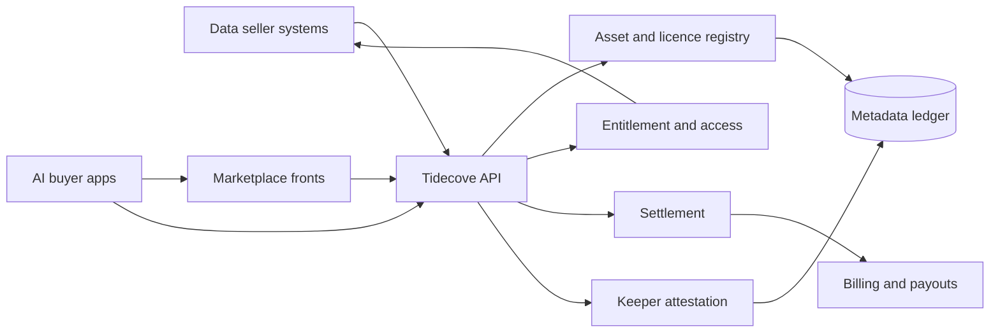

# Tidecove

**Source:** `ai-in-decentralized+ai/openminedOcean Protocol Business Whitepaper/`
**Domain:** `ai-decentralized`
**One-liner:** An enterprise ai-data exchange where rights-holders publish priced or commons datasets once and sell access across many marketplaces without hosting raw data at a central intermediary.
**Wedge:** Singapore and EU regulated industries with high-value proprietary datasets (autonomous-vehicle fleets, financial-data commercialisation, hospital research networks) that refuse to upload raw data to a third-party exchange.
**Positioning:** A protocol-grade two-sided data market, not another siloed data broker. Centralized exchanges fail on hosting, custody, and lock-in; Tidecove keeps pricing and metadata at a shared liquidity layer so marketplaces compete on UX while supply stays portable.

## Market research synthesis

### Thesis from source

The Ocean Protocol business memorandum argues that the world’s data is exploding while almost none of it is put to work: 1 ZB produced in 2010, 16 ZB in 2016, and 160+ ZB projected by 2025, yet McKinsey’s oft-cited figure is that only about 1% of data is analysed. Big-data and analytics spend was expected to reach $187B by 2019; PwC estimated commercialising financial data alone could be worth $300B annually; Capgemini found 61% of respondents treating big data as a revenue driver. Tractica projected AI software and services at roughly $60B by 2025 across 150+ use cases in 29 industries. The binding constraint is not algorithms but access: Wissner-Gross’s claim, quoted in the source, is that breakthroughs arrive about six times faster when high-quality data appears (≈3 years from data availability vs ≈18 years from algorithm proposals). Startups drown in models and starve for data; incumbents with both data and AI talent concentrate power.

Sharing fails because once data leaves the owner it is “in the wild” without control, usage audit, or fair compensation. Centralized exchanges are the natural marketplace but are structurally limited: they require hosting at the exchange, concentrate custody risk, and lock offers into a single front door. Ocean’s answer is a decentralized substrate that stores metadata, ownership, and licensing; leaves data behind firewalls when required; lets many marketplaces access the same offers; and prices at the shared protocol layer so liquidity is not trapped. Tokens incentivise keepers who validate and run network services. Singapore appears as the lead government partner for a national data-sharing hub and regulatory sandbox for decentralized marketplaces. The commercial object is therefore not “another data portal” but a rights-preserving publish-once, sell-many exchange that brings compute to heavy data when gravity makes transfer impractical (e.g. 100 human genomes ≈ 30 TB).

### Buyer & economic model

- **Primary buyer:** Chief Data Officer or Head of Data Monetisation at a data-rich enterprise; secondary buyer is the marketplace operator (DEX-style last-mile) that white-labels the exchange.
- **Users:** data stewards and custodians (publish, license, revoke), data scientists and AI product teams (discover, purchase, train), marketplace operators (curate vertical catalogues), network keepers/ops, compliance and privacy officers.
- **Budget owner / value metric:** data commercialisation P&L and AI programme budget. Value metric is revenue per published asset and time-to-first-usable training set for buyers; for sellers, control retention (no forced hosting) and dispute-free settlement rate.
- **Competing status quo:** bilateral NDAs and SFTP dumps; centralized data brokers that demand upload; internal data lakes with no external monetisation path; one-off research collaborations that never productise.

### Domain constraints

- **Regulatory / trust / safety:** personal-data regimes (PDPA/GDPR-class), sector rules for health and finance, IP licensing and provenance, sanctions/KYC for marketplace participants, Singapore sandbox expectations for marketplace operators.
- **Data sensitivity:** many assets cannot leave premises; buyers may need on-prem or privacy-preserving compute rather than bulk download; metadata must not leak commercially sensitive schema beyond what the seller publishes.
- **Change-management realities:** enterprises will not abandon incumbent warehouses; Tidecove must publish references and licences over existing storage. Marketplaces need fiat on-ramps even if settlement is tokenised underneath. Liquidity requires portable offers across multiple fronts, not a single branded storefront.

## Business requirements

- BR-1: A data rights-holder must publish an asset with ownership, licence terms, and access location without being required to host the raw payload at Tidecove.
- BR-2: The same published offer must be discoverable and purchasable through multiple marketplace fronts while price and licence remain authoritative at the shared exchange layer.
- BR-3: Settlement must complete only when access conditions in the licence are met, with an auditable record of who accessed what under which terms.
- BR-4: Sellers must retain revocation and licence-amendment rights that take effect for new purchases within a defined SLA, with grandfathering rules stated per licence.
- BR-5: Buyers must be able to filter assets by licence class (priced, commons, on-prem compute-only) before spending budget, so gravity-bound datasets are not sold as downloadable when they are not.
- BR-6: Marketplace operators must disclose take-rate as a single line item; protocol-layer pricing must not be silently marked up per marketplace.
- BR-7: Personal-data assets must carry a lawful-basis and purpose tag; purchases that would violate stated purpose must be blocked, not merely warned.
- BR-8: Keepers and service providers must be economically accountable: failed verification or availability below threshold must create a clawback or penalty event visible to counterparties.
- BR-9: Finance on both sides must export period statements tying purchases, refunds, and access events to invoices suitable for external audit.
- BR-10: Public/commons assets must be incentivised distinctly from priced assets so free datasets are not crowded out of curation attention.
- BR-11: The platform must support bringing compute to data for assets above a transferability threshold defined by the seller.
- BR-12: Participant identity for enterprise counterparties must be registry-vetted enough to support commercial dispute resolution, without requiring full public doxxing of every end user.

## User stories

Canonical user stories live in sibling [USER_STORIES.md](USER_STORIES.md).

## System design

### Overview

Tidecove is a two-sided ai-data exchange. Sellers register assets with metadata, IP/licence terms, and a pointer to storage or an on-prem compute endpoint. Offers sit at a shared liquidity layer. Marketplace fronts index those offers for vertical discovery. Buyers purchase entitlements; settlement releases access credentials or schedules compute-to-data jobs; keepers attest availability and delivery. Tokens (or fiat wrappers) settle value between buyers, sellers, mashers, and keepers. The system never becomes the exclusive host of raw enterprise data unless the seller chooses commons hosting.

### Actors & boundaries

- **Actors:** data owner/custodian, data consumer (AI team), marketplace operator, data masher/enricher, network keeper, regulator/auditor, platform operator.
- **Trust boundary:** raw payloads remain in seller-controlled storage; Tidecove holds metadata, licences, entitlements, settlement, and attestations. Marketplaces read offers and mediate UX but cannot unilaterally alter protocol price or licence.
- **Human-in-the-loop points:** enterprise seller onboarding and KYC; licence approval for regulated assets; dispute adjudication; keeper penalty overrides; commons curation challenges.

### Core capabilities

1. **Asset publishing & metadata registry** — ownership, schema summary, storage pointer, gravity/compute flags.
2. **Licensing & entitlement** — priced, commons, and compute-only licence classes with revocation.
3. **Marketplace catalogue federation** — multiple fronts over shared offers with disclosed take-rates.
4. **Discovery & purchase** — search, preview policies, checkout, entitlement issuance.
5. **Access delivery** — credentials, download windows, or compute-to-data job scheduling.
6. **Keeper attestation & penalties** — availability/delivery proofs with economic consequence.
7. **Settlement & statements** — buyer charges, seller payouts, marketplace fees, audit exports.
8. **Compliance gating** — lawful basis/purpose tags and purchase blocks.
9. **Governance & participant registry** — vetted enterprise identities, suspensions, dispute cases.

### Conceptual data

- **Primary entities:** Participant, Asset, LicenceOffer, MarketplaceFront, Entitlement, AccessCredential, ComputeJob, KeeperAttestation, SettlementStatement, Dispute, ComplianceTag.
- **Critical events:** asset published, offer priced, purchase completed, entitlement issued, access attested, licence revoked, keeper penalised, dispute opened/resolved, statement issued.
- **Retention / audit needs:** licence history, entitlements, and access attestations retained for the commercial and regulatory window; personal identifiers minimised in metadata; raw data never retained by Tidecove unless seller opts into commons hosting.

### Integrations (conceptual)

- **Systems of record:** seller object stores / warehouses, DLP and consent systems, ERP/billing, marketplace storefronts.
- **Upstream signals:** industry data dictionaries, government open-data feeds, keeper reputation, KYC/registry providers.
- **Downstream actions:** credential issuance, compute job runners, payout rails, compliance exports, marketplace index updates.

### High-level architecture

### Success metrics

- **Leading:** assets published with complete licence tags; % offers available on ≥2 marketplace fronts; median time from publish to first purchase; compute-to-data job success rate.
- **Lagging:** GMV of settled entitlements; seller repeat-publish rate; dispute rate per 1,000 purchases; % personal-data purchases blocked for purpose mismatch.

## OpenAPI skeleton

Canonical HTTP surface lives in sibling `openapi.yaml`. Summarize here:

- **Base path:** `/v1/...`
- **Auth:** API key and/or Bearer JWT (operator)
- **Resource groups:** Assets, LicenceOffers, Entitlements, MarketplaceFronts, KeeperAttestations, Settlements
