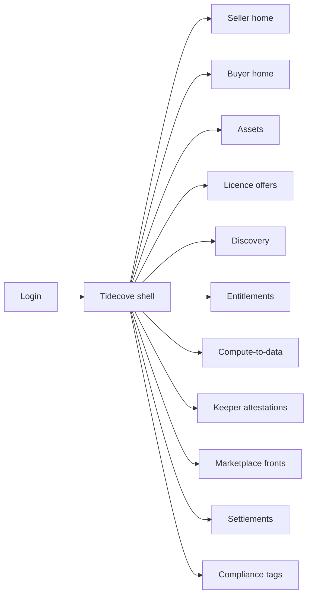
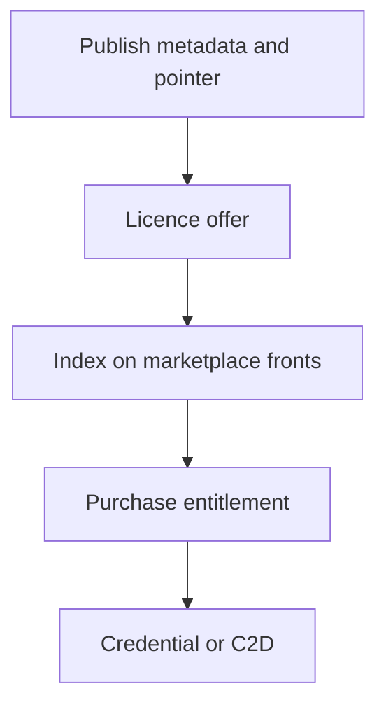

# Tidecove — Web app

**Product:** [PRODUCT.md](./PRODUCT.md)
**Primary surface:** Dual-sided ai-data exchange console (Seller publish desk + Buyer discovery under one Tidecove shell)
**Secondary surfaces:** Marketplace operator catalogue admin; finance settlement statement viewer
**Design thesis:** Tidecove is a harbour for offers — publish once, sell across many fronts — not a data lake UI and not a crypto DEX chart wall. The UI metaphor is a cove of moored assets: raw cargo stays at the seller’s quay; only licence buoys and price markers float in the shared water. Visual language is deep tide-navy and foam-silver with licence-green settlement confirmation: compute-to-data assets feel heavy (gravity badge); commons assets feel open water; purpose-blocked purchases feel coral closed. The Tidecove wordmark sits as a quiet harbour mark on every money-bearing screen so counterparties know whose portable price they are trusting.

## UX research synthesis

### Category peers (best-in-class)

- **AWS Data Exchange / Snowflake Marketplace:** Enterprise listing, licence terms, and entitlement without forcing a single consumer UX. Steal: publish metadata + access location with seller-controlled hosting; reject “must upload to us” as the only path.
- **Databricks Marketplace / Azure Data Share:** Cross-org share with clear consumption modes. Steal: filter by download vs in-place before checkout (BR-5); reject lake-browser aesthetics for regulated PD assets.
- **Ocean Market (historical reference UX):** Protocol offers across fronts. Steal: shared price/licence authority with marketplace take-rate as one line (BR-6); reject token-wallet complexity as the enterprise home.
- **Refinitiv / Bloomberg data licensing desks (pattern):** Commercial statements tying access to invoices. Steal: period statements for both sides (BR-9).

### Patterns to adopt / reject

- **Adopt:** Publish without central hosting; portable offers across marketplace fronts; licence classes (priced/commons/compute-only); purpose/lawful-basis gates that block; revocation with entitlement impact; disclosed take-rate; keeper penalties; compute-to-data scheduling; vetted enterprise registry.
- **Reject:** Forced upload to Tidecove; silent marketplace markups; download sold for gravity-bound assets; purple “AI data lake” glow; editable access history; anonymous enterprise counterparties with no dispute path.

### Trust, density, and workflow constraints from PRODUCT.md

Sellers keep custody (BR-1); price/licence authoritative at shared layer across fronts (BR-2). Settlement only when licence conditions met with audit of who accessed what (BR-3). Personal-data purchases that violate purpose are blocked (BR-7). Gravity-bound assets need compute-to-data (BR-11). Finance needs audit-grade statements (BR-9). Density is commercial: licences, entitlements, attestations — not vanity “datasets available” tiles.

## Information architecture

### Nav model

### Roles → default home

| Role | Default home | Why |
|------|--------------|-----|
| Data monetisation lead | Seller home | Revenue and control retention |
| Data steward | Assets | Publish without hosting at Tidecove (BR-1) |
| AI product / data scientist | Buyer discovery | Licence and compute filters (BR-5) |
| Marketplace operator | Marketplace fronts | Curate over shared offers (BR-2, BR-6) |
| Compliance officer | Compliance tags | Purpose blocks (BR-7) |
| Finance | Settlements | Period statements (BR-9) |

### Cross-links to OpenAPI resources

| Nav area | OpenAPI tags / resources |
|----------|---------------------------|
| Assets | Assets |
| Licence offers | LicenceOffers |
| Entitlements / access | Entitlements |
| Marketplace fronts | MarketplaceFronts |
| Keeper attestations | KeeperAttestations |
| Settlements | Settlements |

## Screen inventory

### Seller home

- **Purpose:** Answer “are my portable offers selling, and is custody still mine?” in one composition.
- **Entry:** Seller login default.
- **Layout regions:** Brand + org; GMV and active entitlements; offers on ≥2 fronts indicator; revocation alerts; keeper SLA strip.
- **Primary actions:** Publish asset; amend licence; open statement.
- **Empty / loading / error:** Empty = publish first VPC-resident asset; loading = skeletons.
- **BR / story ties:** BR-1, BR-2; monetisation stories.

### Asset publish

- **Purpose:** Register ownership, schema summary, storage pointer, gravity/compute flags — no mandatory raw upload.
- **Entry:** Nav → Assets → Publish.
- **Layout regions:** Metadata form; storage pointer / VPC endpoint; gravity threshold; PD compliance tags; preview of what marketplaces will see.
- **Primary actions:** Publish; save draft; validate pointer reachability via keeper.
- **Empty / loading / error:** Pointer fail = block publish; PD missing tags = block.
- **BR / story ties:** BR-1, BR-7, BR-11.

### Licence offer editor

- **Purpose:** Set priced, commons, or compute-only terms with revocation/amendment SLA and grandfathering.
- **Entry:** From asset; Licences nav.
- **Layout regions:** Licence class picker; price; purpose/lawful basis; revoke impact preview on active entitlements; marketplace visibility.
- **Primary actions:** Publish offer; amend; revoke new purchases.
- **Empty / loading / error:** Class mismatch (e.g. download on compute-only) = validation error.
- **BR / story ties:** BR-4, BR-5, BR-10.

### Buyer discovery

- **Purpose:** Search by sector, licence class, and compute-in-place vs download before spending.
- **Entry:** Buyer default.
- **Layout regions:** Filters (licence, gravity, commons vs paid); result list; purpose match chip; take-rate disclosure on detail.
- **Primary actions:** Open asset; purchase; add to shortlist.
- **Empty / loading / error:** No matches = broaden filters; purpose mismatch assets hidden or blocked.
- **BR / story ties:** BR-5, BR-7; buyer stories.

### Purchase and entitlement

- **Purpose:** Checkout unlocks time-boxed credential or schedules compute-to-data — not a legal side quest forever.
- **Entry:** From discovery; Entitlements.
- **Layout regions:** Licence summary; take-rate line; purpose gate; entitlement status; credential panel.
- **Primary actions:** Purchase; copy credential; open compute job.
- **Empty / loading / error:** Purpose violation = hard block (BR-7); payment fail = retry.
- **BR / story ties:** BR-3, BR-6.

### Compute-to-data jobs

- **Purpose:** Bring compute to heavy assets above seller transferability threshold.
- **Entry:** Entitlement → Compute; C2D nav.
- **Layout regions:** Job queue; seller endpoint status; result delivery without raw export; attestation.
- **Primary actions:** Schedule job; cancel; download allowed outputs only.
- **Empty / loading / error:** Endpoint down = no charge path (align with unreachable fail).
- **BR / story ties:** BR-11.

### Marketplace fronts admin

- **Purpose:** Index shared offers into vertical catalogues with disclosed take-rate — no silent markup of protocol price.
- **Entry:** Operator login.
- **Layout regions:** Front list; indexed offers; take-rate config; fiat on-ramp flag.
- **Primary actions:** Curate; set take-rate; sync index.
- **Empty / loading / error:** Empty front = pull from protocol offers.
- **BR / story ties:** BR-2, BR-6.

### Keeper attestations

- **Purpose:** Availability/delivery proofs with clawback/penalty visibility.
- **Entry:** Ops / seller alerts.
- **Layout regions:** Attestation table; SLA threshold; penalty events; counterparty-visible status.
- **Primary actions:** Review penalty; dispute attestation.
- **Empty / loading / error:** Below threshold = coral penalty state.
- **BR / story ties:** BR-8.

### Settlements and statements

- **Purpose:** Export period statements tying purchases, refunds, access events to invoices.
- **Entry:** Finance home.
- **Layout regions:** Period picker; buyer/seller views; take-rate lines; export.
- **Primary actions:** Generate statement; download.
- **Empty / loading / error:** No activity = clear empty.
- **BR / story ties:** BR-9.

### Compliance purpose gate

- **Purpose:** Enforce lawful-basis and purpose tags; block non-compliant purchases.
- **Entry:** Compliance; checkout interrupt.
- **Layout regions:** Asset tags; buyer declared purpose; allow/block decision log.
- **Primary actions:** Update tags; export diligence pack.
- **Empty / loading / error:** Untagged PD asset = cannot list.
- **BR / story ties:** BR-7.

### Participant registry

- **Purpose:** Vetted enterprise identities for dispute resolution without full public doxxing of every end user.
- **Entry:** Admin / onboarding.
- **Layout regions:** Org registry; KYC status; suspension; dispute contact.
- **Primary actions:** Approve participant; suspend; open dispute case.
- **Empty / loading / error:** Unvetted = limited commercial features.
- **BR / story ties:** BR-12.

### Commons curation lane

- **Purpose:** Keep free datasets visible and incentivised distinctly from priced supply.
- **Entry:** Buyer discovery commons filter; seller commons publish.
- **Layout regions:** Commons shelf; incentive events; anti-crowding vs paid sort.
- **Primary actions:** Contribute commons; feature commons.
- **Empty / loading / error:** N/A.
- **BR / story ties:** BR-10.

## Key flows

1. **Publish once, sell many** — publish asset (no upload) → licence → index on fronts → purchase anywhere → same price/licence; failure: pointer unreachable blocks list.

2. **Purpose-blocked buy** — buyer selects PD asset → purpose check → block if mismatch (BR-7).

3. **Revoke / amend** — seller amends → new purchases use new terms → active entitlements listed per grandfathering (BR-4).

4. **Compute-to-data** — gravity asset → schedule job at seller → attest → settle without raw transfer (BR-11).

5. **Keeper penalty** — SLA miss → penalty event → visible to counterparties → statement impact (BR-8).

## Design system

### Tokens (CSS variables)

- `--color-ink: #E8F0F4` — primary text
- `--color-tide-950: #071018` — app ground
- `--color-tide-900: #0F1C28` — panels
- `--color-foam: #A8B8C4` — secondary labels
- `--color-harbour: #3D9EBF` — offer / harbour accent
- `--color-licence: #3DDC97` — settled entitlement
- `--color-amber: #E0A12B` — gravity / provisional
- `--color-coral: #E85D4C` — purpose block / penalty
- `--color-brand: #7EC8E3` — Tidecove wordmark
- `--font-display: "Literata", serif` — asset and harbour titles
- `--font-body: "Source Sans 3", sans-serif`
- `--font-mono: "IBM Plex Mono", monospace` — asset ids, credentials
- `--space-1`…`--space-8`: 4px scale
- `--radius-sm: 4px`; `--radius-md: 8px`
- `--motion-moor: 200ms ease-out` — offer docks into catalogue
- `--motion-block: 240ms ease-in` — purpose gate coral flash
- Atmosphere: subtle horizontal tide lines; soft cove vignette; no stock server-room heroes in console.

### Typography & brand

- Literata for asset titles; mono for credentials and settlement ids.
- Brand harbour mark left of chrome on publish, purchase, and statement screens.
- Login: brand hero, one headline (“Publish once. Sell across markets. Keep the data.”), one CTA.

### Do / don’t

- **Do:** Custody-first publish; take-rate one line; hard purpose blocks; gravity badges; portable price across fronts.
- **Don’t:** Purple AI glow; forced upload; silent markups; vanity dataset counts; editable attestations.

### Accessibility & domain trust cues

- AA+ harbour/licence/coral on tide; purpose block uses text “Purchase blocked — purpose mismatch.”
- Live regions for revocation and keeper penalties.
- Focus order: publish → licence → discovery → entitlement → statement.
- Provenance packs machine-readable for diligence.

## Component patterns

- **CustodyPointerField** — storage/VPC ref with reachability check.
- **LicenceClassPicker** — priced / commons / compute-only.
- **TakeRateLine** — disclosed marketplace fee.
- **PurposeGateBanner** — hard block on mismatch.
- **GravityBadge** — compute-to-data required.
- **PortableOfferChip** — fronts indexing same licence.
- **KeeperPenaltyRow** — SLA miss with clawback.
- **EntitlementCredentialPanel** — time-boxed access.
- **SettlementStatementExport** — audit period pack.

## Out of scope for v1 web

- Full data warehouse IDE; consumer app stores; on-chain wallet trading UI as home; Quayside vertical operator plane; Veridrop incentive kernel consoles; native mobile buyer apps.
